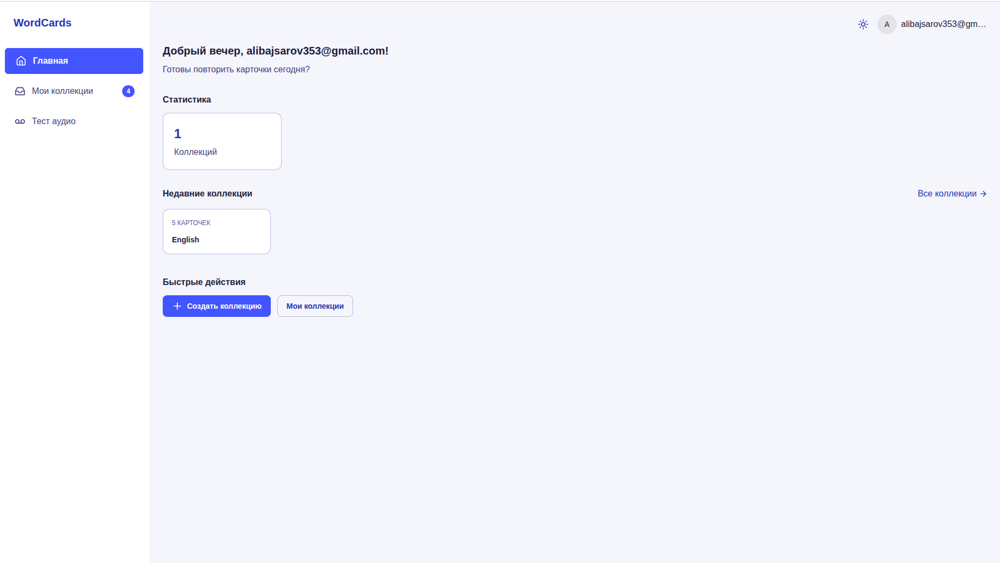
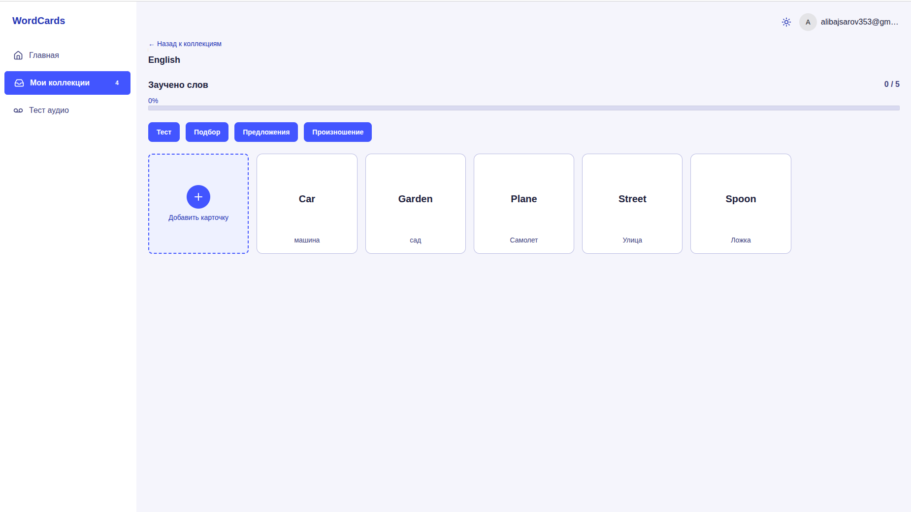
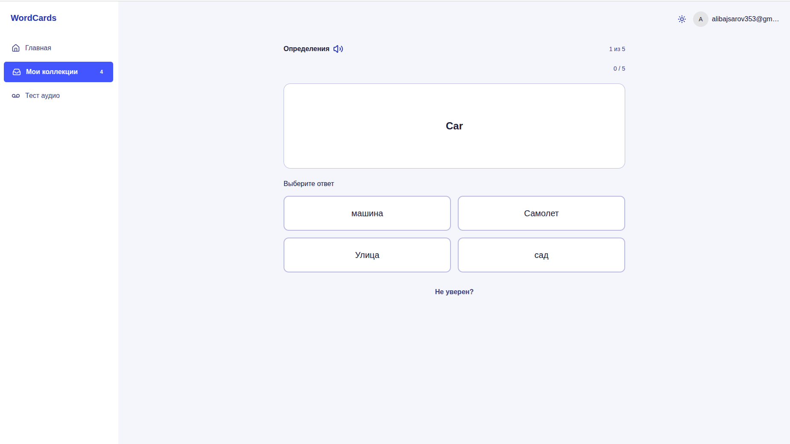
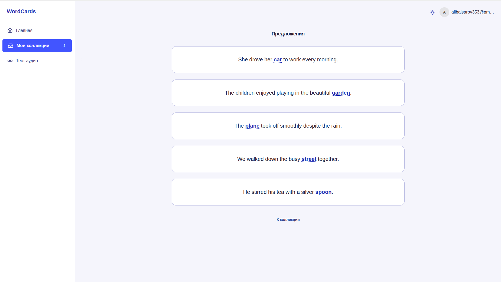

# Word Cards

Fullstack-приложение для изучения слов с помощью карточек. Поддерживает несколько режимов обучения: тесты, матчинг, аудиоуроки, примеры предложений и интеграцию с AI.

## Скриншоты

| Главная | Коллекция |
|---------|-----------|
|  |  |

| Тест | Предложения |
|------|-------------|
|  |  |

## Стек технологий

**Backend:** Express 5, TypeScript, Prisma ORM, PostgreSQL, JWT, LangChain + OpenAI, Multer, FFmpeg

**Frontend:** React 19, Vite, Chakra UI v3, React Query, React Router v7, React Hook Form

## Структура проекта

```
frontend/        # React + Vite
backend/         # Express API
docker-compose.local.yml
```

## Быстрый старт

### 1. Клонировать репозиторий

```bash
git clone <repo-url>
cd word-cards
```

### 2. Настроить переменные окружения

```bash
cp backend/.env.example backend/.env
cp frontend/.env.example frontend/.env
```

Заполнить обязательные переменные в `backend/.env`:

| Переменная | Описание |
|------------|----------|
| `APP_PORT` | Порт backend-сервера |
| `POSTGRES_USER` | Пользователь БД |
| `POSTGRES_DB` | Имя БД |
| `POSTGRES_PASSWORD` | Пароль БД |
| `JWT_ACCESS_SECRET` | Секрет для access-токена |
| `JWT_REFRESH_SECRET` | Секрет для refresh-токена |
| `CORS_ORIGIN` | URL фронтенда (по умолчанию `http://localhost:5173`) |
| `OPENAI_API_KEY` | API-ключ OpenAI |

В `frontend/.env`:

| Переменная | Описание |
|------------|----------|
| `VITE_API_URL` | URL backend API (по умолчанию `http://localhost:3010/api`) |

### 3. Запустить через Docker

```bash
docker-compose -f docker-compose.local.yml up
```

Сервисы:
- **Frontend** — `http://localhost:5173`
- **Backend** — `http://localhost:<APP_PORT>` (по умолчанию 3010)
- **PostgreSQL** — порт `DB_PORT` (по умолчанию 5432)

### 4. Применить миграции

```bash
docker-compose -f docker-compose.local.yml exec backend npx prisma migrate dev
```

## Основные команды

Все команды выполняются внутри Docker-контейнеров:

```bash
# Установить зависимости
docker-compose -f docker-compose.local.yml exec backend npm install
docker-compose -f docker-compose.local.yml exec frontend npm install

# Сгенерировать Prisma-клиент
docker-compose -f docker-compose.local.yml exec backend npx prisma generate

# Создать миграцию
docker-compose -f docker-compose.local.yml exec backend npx prisma migrate dev --name <name>

# Линтинг фронтенда
docker-compose -f docker-compose.local.yml exec frontend npm run lint

# Сборка
docker-compose -f docker-compose.local.yml exec backend npm run build
docker-compose -f docker-compose.local.yml exec frontend npm run build
```

## API

Все маршруты доступны по префиксу `/api`:

| Метод | Маршрут | Описание |
|-------|---------|----------|
| POST | `/api/auth/login` | Авторизация |
| POST | `/api/auth/register` | Регистрация |
| GET | `/api/collections` | Список коллекций |
| GET | `/api/collections/:id` | Коллекция по ID |
| POST | `/api/collections` | Создать коллекцию |
| GET/POST | `/api/cards` | CRUD карточек |
| — | `/api/audio` | Аудио-эндпоинты |

## Модели данных

- **User** — пользователи
- **Collection** — коллекции карточек
- **WordCard** — карточки (`frontText` / `RearText`)
- **CollectionTest** — тестовые сессии
- **CollectionTestAnswer** — ответы на тесты
- **Sentence** — примеры предложений для карточек

## Режимы обучения

- **Тест** — проверка знания слов
- **Матчинг** — соединение пар слов
- **Аудиоурок** — обучение через аудио
- **Предложения** — примеры использования слов (с AI-генерацией)
